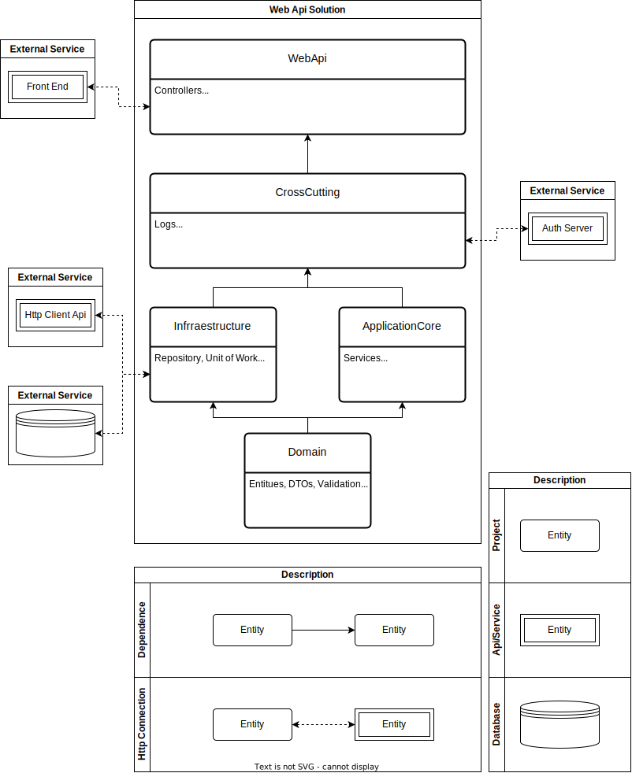

# Create new solution script

This is a powershell script to build a DotNet Solution Template. To use this template execute the following command.

`Set-ExecutionPolicy -ExecutionPolicy Unrestricted -Scope CurrentUser`

`./solution.ps1 -Name <Name> -Framework <FRAMEWORK> -Database <Database Name>`

## Default values

The Default values are:

* `<Name> = Template`
* `<Framework> = net7.0`
* `<Entity> = true` 
* `<Database> = mssql`

### Possible Framework Values

`-Framework <FRAMEWORK>`

Specifies the framework to target. Option not available in .NET Core 2.2 SDK.

The following table lists the default values according to the SDK version number you're using:

|SDK version | Default value|
|-|-|
|7.0 | net7.0 | 
|6.0 | net6.0 |
|5.0 | net5.0 |
|3.1 | netcoreapp3.1 |

execute `dotnet --list-sdks` to know wich sdk is installed on yur machine

### Possible Database Names avalible

set `<Entity> = false`, if you don't want to install Entity Framework and Entity FrameWork Provider.

|Database Name | Nuget Url|
|-|-|
|mssql   | [Microsoft sql server](https://www.nuget.org/packages/Microsoft.EntityFrameworkCore.SqlServer/7.0.9) | 
|sqlite  | [SqLite](https://www.nuget.org/packages/Microsoft.EntityFrameworkCore.Sqlite/7.0.9) |
|npgsql  | [PostgreSQL](https://www.nuget.org/packages/Npgsql.EntityFrameworkCore.PostgreSQL/7.0.4) |
|mysql   | [MySql](https://www.nuget.org/packages/MySql.EntityFrameworkCore/7.0.5) |
|oracle  | [Oracle](https://www.nuget.org/packages/Oracle.EntityFrameworkCore/7.21.9) | 
|pomelo  | [Pomelo](https://www.nuget.org/packages/Pomelo.EntityFrameworkCore.MySql/7.0.0) |

any other database provider sould be instaled separeted, also are instaled

|Package Name | Nuget url |
|-|-|
| Entity Framework Tools | [dotnet-ef ](https://www.nuget.org/packages/dotnet-ef/7.0.9) |
|Entity Framework Core| [EntityFrameworkCore](https://www.nuget.org/packages/Microsoft.EntityFrameworkCore/7.0.9) |

# Template Architeture

The Following Architeture will be created.

* WebApi 
  
    Main part of the Project
  
   * Controllers
   * Static Configuration Files
   * Build Files
   * 
* CrossCutting

    Responsable for configuration, security, logging and Authentication/Autorization connection with SSO service, if necessary

* ApplicationCore

    Responsable for the bussines logic

* Infraestructure

    Resposable for external connection logic such as
    * Database logic
    * Http client logic (external services)

* Domain

    Definition project. 

    * Entities, DTOs
    * Exceptions
    * Constants
    * Interfaces
    * Validation